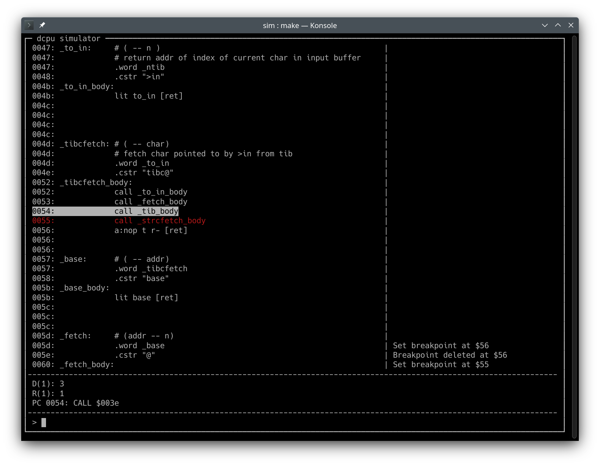

# dcpu
__16 Bit Stack Machine__

DCPU is a pretty minimal stack processor suitable for executing Forth.
This repo includes the CPU implemented in Verilog, an assembler written in Python and a simulator
written in C/C++ using Verilator.

DCPU has no user accessible registers (except a carry flag register). Instead it uses two hardware stacks (data stack, return stack). A stack entry is 16-bit wide. All memory accesses are also 16-bit, and the CPU can access a 16-bit address space of 16-bit words. No 8-bit accesses are possible, this must be handled in software.

## CPU instructions

### Opcodes overview

Subroutine calls: `0   <addr:15>`

Push 13-bit literal: `100 <imm:13>`

Set upper 8-bit literal: `101 <unused:4> <return:1> <imm:8>`

ALU operations: `110 <unused:1> <alu:5> <return:1> <dst:2> <dsp:2> <rsp:2>`

Relative jumps: `111 <cond:3> <imm:10>`


### Detailed explanation

Abbreviations used:
- T: Top item on the data stack
- N: Second item on the data stack
- R: Top item on the return stack
- PC: Program counter
- DSP: Data stack pointer
- RSP: Return stack pointer

__Subroutine calls__

For an efficient subroutine threading Forth, I decided to dedicate half of the instruction space for
calls. These calls can access only the lower part of the address space.
```
0 <addr:15>
```
Assembler mnemonic:
```
call $1000
```
to call a subroutine at address $1000. This will push the current program counter plus one (PC+1) onto
the return stack and sets the PC = $1000.

For calls to the upper half of the address space, the address has to be on the stack and an ALU instruction has to be used.

__Literal pushes__

Push 13-bit literal on data stack:
```
100 <imm:13>
```
Assembler mnemonic:
```
lit.l $123
```
The upper 3 bits [15:13] will be zero. For a number greater than 13-bits, the upper byte of `T` can be set with `lit.h`.

Set 8 bit literal to MSB of `T`:
```
101 <unused:4> <return:1> <imm:8>
```
Assembler mnemonic:
```
lit.h $ff
```
This will not push a new value onto the data stack, instead it will overwrite the upper byte of `T`.

If the `return` bit is set, the instruction will additionally do a return, meaning popping R from the return stack into PC. To set the return bit, append `[ret]` to the mnemonic:

```
lit.h $ff [ret]
```

There are still 4 unused bits, which may be used in the future.

As a convinience, the assembler provides `lit`:
```
lit $ffff
```
`lit` will expand into two instructions if neccessary: `lit.l $3ff` and `lit.h $ff`.

__ALU__

The ALU is used not only for arithmetic functions, but also for data transfers, stack pointer manipulations, jumps and function calls and returns.

ALU opcode structure:
```
110 <unused:1> <alu:5> <return:1> <dst:2> <dsp:2> <rsp:2>
```
The mnemonic has the form
```
a:<alu-op> <dst> <dsp> <rsp> [ret]
```

ALU opcode fields:
- `rsp`: Return stack pointer manipulation
    - `00`: Do nothing
    - `01`: Increment return stack pointer (`r+`)
    - `10`: Decrement return stack pointer (`r-`)
    - `11`: Increment return stack pointer by pushing PC to return stack (for subroutine calls) (`r+pc`)
- `dsp`: Data stack pointer manipulation
    - `00`: Do nothing
    - `01`: Increment data stack pointer (`d+`)
    - `10`: Decrement data stack pointer (`d-`)
    - `11`: Do nothing
- `dst`: Destination, where ALU result will be written to
    - `00`: Write to T (`T`)
    - `01`: Write to R (`R`)
    - `10`: Write to PC (for jumps, calls and returns) (`PC`)
    - `11`: Write to memory (address indicated by T) (`MEM`)
- `return`: Perform a subroutine return
    - `0`: Do nothing
    - `1`: Pop from R into PC (`[ret]`)
- `alu`: Operation to be performed by the ALU
    - `$00`: Forward T (`a:t`)
    - `$01`: Forward N (`a:n`)
    - `$02`: Forward R (`a:r`)
    - `$03`: Perform memory read from address indicated by T and forward the result (`a:mem`)
    - `$04`: Calculate `N + T`, set/clear carry flag respectively (`a:add`)
    - `$05`: Calculate `N - T`, set/clear carry flag respectively (`a:sub`)
    - `$06`: NOP (`a:nop`)
    - `$07`: Calculate `N and T` (`a:and`)
    - `$08`: Calculate `N or T` (`a:or`)
    - `$09`: Calculate `N xor T` (`a:xor`)
    - `$0a`: Signed comparison: `N < T ? $ffff : 0` (`a:lts`)
    - `$0b`: Unsigned comparison: `N < T ? $ffff : 0` (`a:lt`)
    - `$0c`: Right shift T by 1, modifies carry flag (`a:sr`)
    - `$0d`: Right shift T by 8, does not modify carry flag (`a:srw`)
    - `$0e`: Left shift T by 1, modifies carry flag (`a:sl`)
    - `$0f`: Left shift T by 8, does not modify carry flag (`a:slw`)
    - `$10`: `T==0 ? N : PC+1`, for conditional jump to N (`jz`)
    - `$11`: `T!=0 ? N : PC+1`, for conditional jump to N (`jnz`)
    - `$12`: Forward carry flag (`a:c`)
    - `$13`: `~T` (invert T) (`a:inv`)
    - `$14`: Calculate lower 16 bits of product `N * T` (`a:mull`)
    - `$15`: Calculate upper 16 bits of product `N * T` (`a:mulh`)

The mnemonic is like the opcode structure, except the return field is last:
```
a:<src> <dst> [dsp] [rsp] [ret]
```
Every ALU instruction must begin with `a:`, then following the src, which is the alu-op to be performed. The next field is the destination where the ALU result will be written to. `dsp`, `rsp` and `[ret]` are optional fields.

If the ALU operation manipulates a stack pointer, this has no effect on the source operands, but on `dst`. For example, when performing an addition:
```
lit 1   # ( -- 1)
lit 2   # (1 -- 1 2)
a:add t # (1 2 -- 1 3)
```
The result replaces T, because the dsp was not changed by `d+` or `d-`. Hint: The **(a b -- a c)** notation shows the stack before and after the operation.

Incrementing the dsp with `d+`:

```
lit 1       # ( -- 1)
lit 2       # (1 -- 1 2)
a:add t d+  # (1 2 -- 1 2 3)
```
Decrementing the dsp with `d-`:

```
lit 1       # ( -- 1)
lit 2       # (1 -- 1 2)
a:add t d-  # (1 2 -- 3)
```

__Relative jumps__

Relative jumps use a 10-bit 2s complement number to manipulate the PC.
```
111 <cond:3> <imm:10>
```
The condition codes and mnemonics are:

|Cond  | Mnemonic | Description
|------|----------|-------------
|`0xx` | `rj`     | jump always
|`100` | `rj.z`   | jump if T = 0
|`101` | `rj.nz`  | jump if T != 0
|`110` | `rj.n`   | jump if T < 0 (`T[15]` is set)
|`111` | `rj.nn`  | jump if T >= 0 (`T[15]` is cleared)


## Simulator


